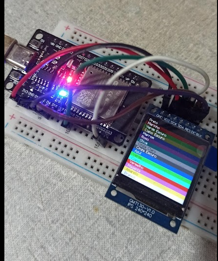
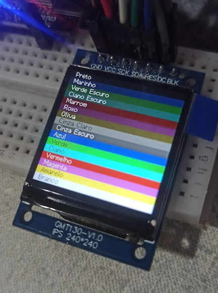

# ST7789 240x240 Display Configuration with ESP32

# Overview

A personal project for testing the 240x240 TFT display where this code was created to test the colors and dimensions of the display# Configuration Details

### Library
- **#include <SPI.h>**
- **#include <TFT_eSPI.h>**

### Custom User Setup

The `User_Setup.h` file has been modified for the ESP32 as follows:

- **Display Driver**: Configured for ST7789.
- **Display Dimensions**: Set to 240x240 pixels.
- **Color Order**: Defined as RGB.
- **Inversion**: Optionally enabled or disabled (depending on need).
- **Pin Assignments**:
  - **MOSI**: GPIO 23
  - **SCLK**: GPIO 18
  - **CS**: Not used (set to -1)
  - **DC**: GPIO 2 (Data/Command control pin)
  - **RST**: GPIO 4 (Reset pin, can be connected to the processor’s RST pin)

